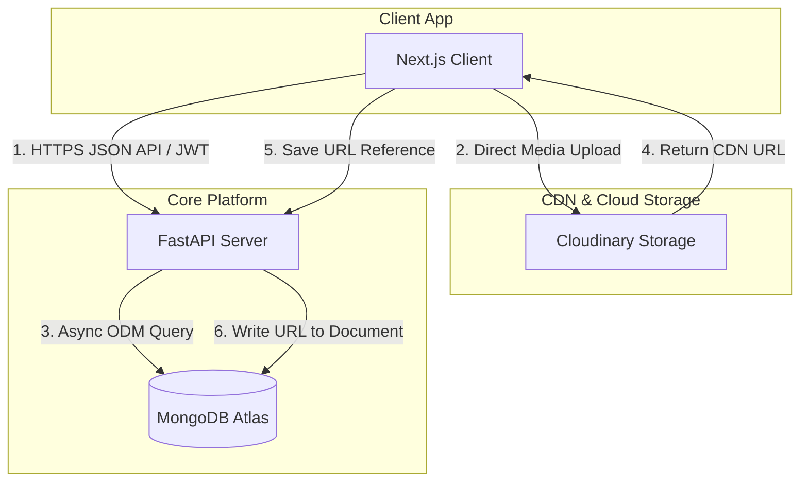

# Eventspace

An intelligent, modular, and multi-tenant Society & Event Management Platform for colleges.

---


---

## 1. Project Overview

### 1.1 What Eventspace Is
Eventspace is a production-grade, multi-tenant Event and Society Management Platform designed to streamline operations, engagement, and administration for university-level technical and cultural societies. It serves as a unified digital ecosystem for student organizers, operational volunteers, evaluators, and participants.

### 1.2 Why It Was Built
Colleges host dozens of student-led clubs, chapters, and societies that independently organize workshops, hackathons, and fests. Typically, these groups rely on fragmented tools (spreadsheets, messaging threads, manual forms) which leads to coordination failures, data leaks, financial opacity, and credential forgery. Eventspace unifies these workflows under a highly configurable, secure, and modern digital platform.

### 1.3 Problems It Solves
* **Operational Fragmentation:** Integrates schedules, task management, and communications into a single interface.
* **Financial Transparency:** Provides auditable ledgers tracking allocations, expenses, and sponsorship incomes.
* **Roster Bottlenecks & Check-in Fraud:** Generates unique QR-code tickets scanned via camera to record duplicate-proof attendance.
* **Evaluation Sluggishness:** Provides judges with digital rubrics to record criteria scores, automatically calculating real-time leaderboards.
* **Verifiable Credentials:** Generates cryptographically secure, downloadable PDF certificates linked to a public lookup portal to prevent forgery.

---

## 2. Key Features

* **Configurable Event Modules:** Toggles platform features (e.g. Teams, Judicial Evaluation, submissions) on or off depending on the event format.
* **Dynamic Registration Form Builder:** Builds custom registration fields (resumes, drop-downs, URLs) per event.
* **Multi-Tenant Roster Controls:** Separates society registries, budgets, and volunteer lists with strict security boundaries.
* **Judicial Scoring Engine:** Supports multi-criteria rubric evaluation and aggregates live leaderboard rankings.
* **Automated PDF Compiler:** Compiles personalized landscape certificates asynchronously and distributes them in bulk via mail queues.
* **Public Verification Portal:** Enables third-party companies or college administration to instantly verify certificates using lookup hashes.
* **Task Collaboration Board:** Allocates, tracks, and notifies volunteers of operational event tasks.

---

## 3. Screenshots (Placeholders)

* **Main Landing Directory:** ``
* **Organizer Dashboard:** ``
* **Dynamic Form Builder:** ``
* **Web-Cam Check-in Scanner:** ``
* **Judge Scoring Sheet:** ``
* **Certificate Lookup Portal:** ``

---

## 4. Technology Stack

| Layer | Technology | Selection Justification |
| :--- | :--- | :--- |
| **Frontend** | Next.js, TypeScript | Provides high page-speed loads via SSR, search-engine optimization, and compile-time type validations. |
| **Styling** | Tailwind CSS, Shadcn UI | Delivers rapid responsive designs, accessible component layouts, and easy theme customization. |
| **Backend** | Python, FastAPI | High-speed asynchronous operations with automated OpenAPI/Swagger documentation generation. |
| **Database** | MongoDB Atlas | Poly-schema document structure perfectly matches dynamic registration forms and customizable event settings. |
| **ODM** | Beanie ODM | Synchronous object-document mapping natively integrated with Pydantic for validation. |
| **Storage** | Cloudinary | Offloads high-bandwidth binary assets (banners, resumes, PDFs) to a dedicated global CDN. |
| **Deployment** | Vercel & Render | Provides serverless client delivery combined with managed, Git-triggered ASGI backend hosting. |

---

## 5. Architecture Overview

Eventspace follows a layered client-server design. The Next.js client interacts with the FastAPI backend through secure JSON APIs. Upload paths route binary assets directly from the client to Cloudinary, ensuring the backend server remains highly performant during heavy usage.



---

## 6. Project Structure

```
eventspace/
├── docs/
│   ├── PROJECT.md                # Product Requirements Document
│   ├── MODULE_SPECIFICATION.md   # Architectural Functional Specs
│   ├── SYSTEM_ARCHITECTURE.md    # Layered Flow & System Design
│   └── DATABASE_DESIGN.md        # Logical Document DB Schema Specs
├── frontend/
│   ├── src/
│   │   ├── components/           # Reusable UI Elements (Shadcn UI)
│   │   ├── hooks/                # React Hooks & Custom States
│   │   ├── pages/                # Views & Dashboards
│   │   └── services/             # Axios API Client Modules
│   └── package.json
├── backend/
│   ├── app/
│   │   ├── models/               # Beanie Document Definitions
│   │   ├── routes/               # API Router Controllers
│   │   ├── services/             # Core Business Logic Rules
│   │   └── main.py               # FastAPI App Bootstrapping
│   ├── requirements.txt
│   └── Dockerfile
└── README.md
```

---

## 7. User Roles

| Role | Scope | Description |
| :--- | :--- | :--- |
| **Super Admin** | Global Platform | Approves new society tenants, audits system logs, and manages global permissions. |
| **Society Admin** | Society Specific | Configures events, defines budgets, issues certificates, and assigns judges/volunteers. |
| **Core Team** | Society Operations | Builds schedules, configures timelines, and manages budget entries. |
| **Volunteer** | Event Specific | Updates assigned tasks and scans participant check-in QR codes. |
| **Judge** | Evaluation Specific | Reviews team submissions and enters criteria evaluation scores. |
| **Participant** | Personal Registry | Registers for fests, creates teams, downloads QR tickets, and claims certificates. |
| **Guest** | Public Views | Browses upcoming fests, previews timelines, and looks up public credentials. |

---

## 8. Core Modules

| Module | Purpose | Main Responsibilities |
| :--- | :--- | :--- |
| **Identity & Access** | Authentication & RBAC | Handles profile creation, secure token auth, and tenant boundaries. |
| **Event Configuration** | Custom Event Settings | Manages status workflows, templates, schedules, and active modules. |
| **Dynamic Form Builder** | Custom Registration | Renders and validates custom form templates for each event. |
| **Project Submission** | Project Tracking | Stores GitHub repositories, demo links, files, and notes for technical contests. |
| **Check-in & Scanning** | Attendance Tracking | Generates unique QR tickets and tracks camera scans during check-in. |
| **Judicial Scoring** | Evaluative Metrics | Evaluates rubrics, saves criteria scores, and calculates leaderboards. |
| **Financial Ledger** | Budget Tracking | Logs cash transactions (expenses/income) and handles receipts. |
| **Credential Manager** | Verification & Lookup | Compiles landscape PDFs and manages public lookup portals. |

---

## 9. Installation Guide

### 9.1 Prerequisites
* Python 3.10+
* Node.js 18+
* MongoDB Atlas Serverless URI
* Cloudinary Developer Account

### 9.2 Clone the Repository
```bash
git clone https://github.com/yourusername/eventspace.git
cd eventspace
```

### 9.3 Backend Setup
1. Navigate to the backend directory and create a virtual environment:
   ```bash
   cd backend
   python -m venv venv
   source venv/bin/activate  # On Windows: venv\Scripts\activate
   ```
2. Install dependencies:
   ```bash
   pip install -r requirements.txt
   ```
3. Configure environment variables (see [Section 10](#10-environment-variables)).
4. Launch the API server:
   ```bash
   uvicorn app.main:app --reload --port 8000
   ```

### 9.4 Frontend Setup
1. Navigate to the frontend directory:
   ```bash
   cd ../frontend
   ```
2. Install dependencies:
   ```bash
   npm install
   ```
3. Configure frontend environment variables.
4. Launch the local dev compiler:
   ```bash
   npm run dev
   ```

---

## 10. Environment Variables

Create a `.env` file in the respective directory root before launching.

### 10.1 Backend Variables (`backend/.env`)
```ini
# Server Configuration
PORT=8000
SECRET_KEY=your_cryptographic_secret_key_string

# Database
DATABASE_URL=mongodb+srv://<user>:<password>@cluster.mongodb.net/eventspace

# Cloudinary Integration
CLOUDINARY_CLOUD_NAME=your_cloudinary_cloud_name
CLOUDINARY_API_KEY=your_cloudinary_api_key
CLOUDINARY_API_SECRET=your_cloudinary_api_secret

# Email Dispatch Setup
SMTP_HOST=smtp.mailprovider.com
SMTP_PORT=587
SMTP_USER=no-reply@eventspace.edu
SMTP_PASS=your_email_app_password
```

### 10.2 Frontend Variables (`frontend/.env.local`)
```ini
# API Route Configuration
NEXT_PUBLIC_API_URL=http://localhost:8000/api/v1
```

---

## 11. Development Workflow

We follow standard branch orchestration to maintain codebase health:

1. **Feature Branching:** Create a descriptive branch from `main`:
   ```bash
   git checkout -b feature/dynamic-form-validator
   ```
2. **Commit Standards:** Use clear, declarative, conventional commit logs:
   ```bash
   git commit -m "feat(form): add email pattern validation checks"
   ```
3. **Pull Requests:** Open a Pull Request on GitHub against `main`. Ensure all unit tests pass before requesting review.

---

## 12. Roadmap

### Version 1.0 (Core Launch)
* [ ] Multi-tenant Identity & RBAC checks.
* [ ] Dynamic registration form builder.
* [ ] QR-ticketing check-in pipeline.
* [ ] Multi-criteria scoring leaderboard.
* [ ] Asynchronous certificate PDF compiles.

### Version 2.0 (Extensions)
* [ ] Interactive, drag-and-drop certificate designer.
* [ ] Push notification alerts & automated SMS queues.
* [ ] In-app group communication workspaces.

### Future Expansion
* [ ] Payment processor integrations (e.g. Stripe) for ticket sales.
* [ ] AI event recommendation algorithms.

---

## 13. Future Enhancements
* **Mobile Applications:** Optimizing scanning speed and judging UI workflows via native mobile builds.
* **GitHub API Integrations:** Auto-calculating code commits, build logs, and pull request activity for automated judging assists.
* **Multi-College Infrastructure:** Transitioning the platform from single-college multi-tenant to multi-college global orchestration.

---

## 14. Contributing
We welcome contributions to Eventspace! Please read our `CONTRIBUTING.md` (to be added) for coding standards, linting guidelines, and test instructions.

---

## 15. License
Distributed under the MIT License. See `LICENSE` for details.

---

## 16. Author

* **Name:** [Your Name]
* **LinkedIn:** [LinkedIn Profile URL Placeholder]
* **GitHub:** [GitHub Profile URL Placeholder]
* **Portfolio:** [Portfolio URL Placeholder]
