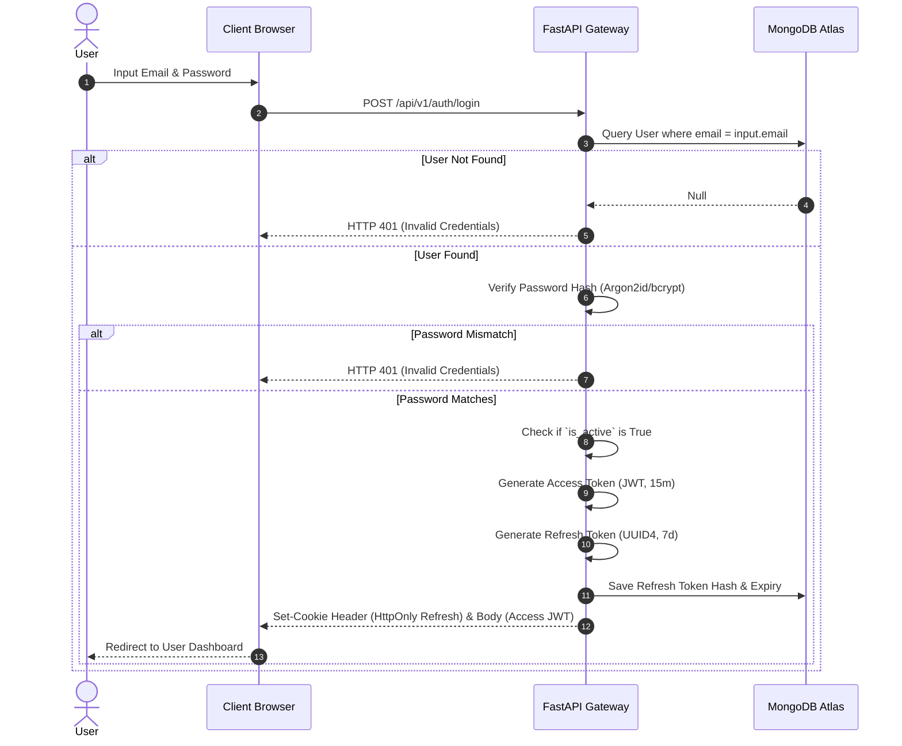
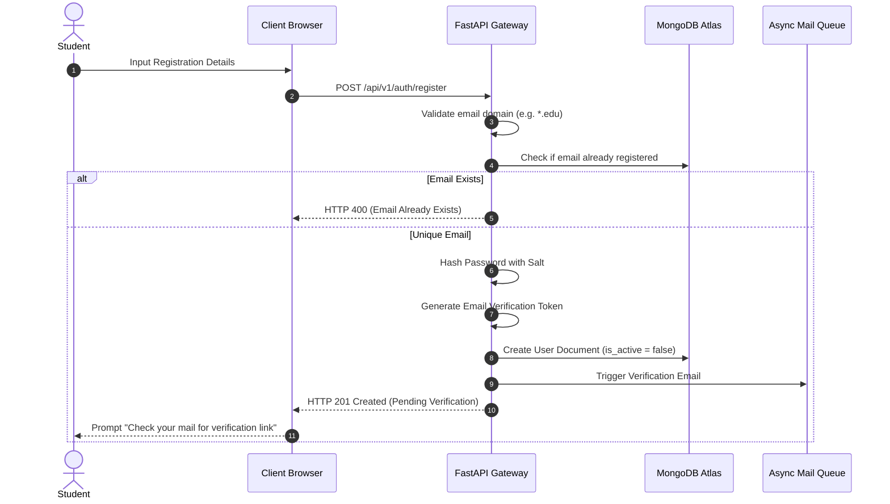
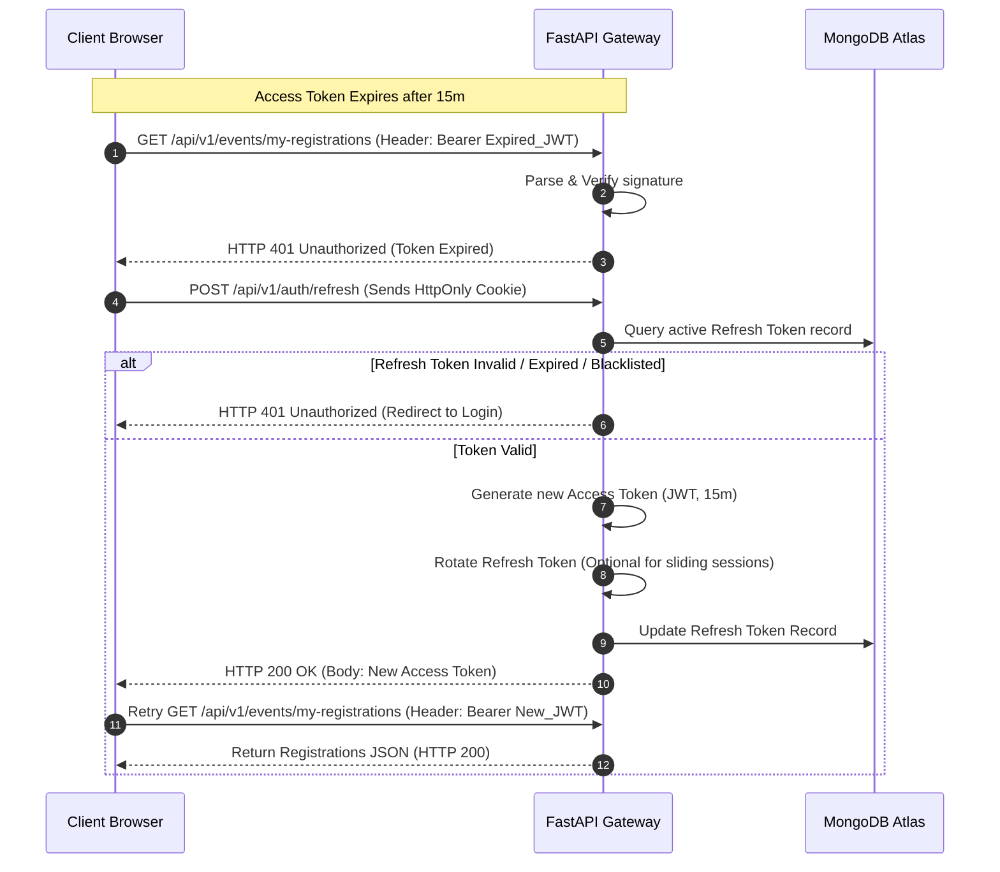
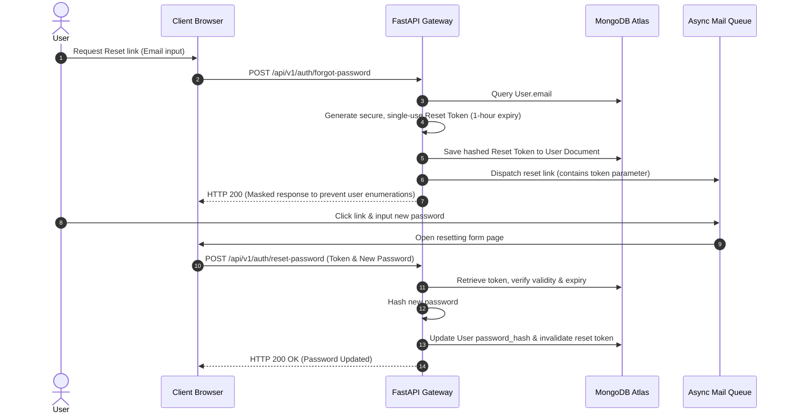

# Authentication & Authorization Design Document
## Eventspace: Society & Event Management Platform

This document describes the design specifications for user identity, authentication states, authorization controls, and tenant isolation policies within Eventspace.

---

### 1. Authentication Overview

Eventspace employs a stateless, token-based authentication mechanism powered by **JSON Web Tokens (JWT)** combined with database-tracked, secure refresh tokens. The system is designed to provide high-performance request scaling, strict multi-tenant boundaries (society-level data isolation), and granular role-based access control.

* **Primary Protocol:** JWT Bearer Authentication over HTTPS.
* **Session Strategy:** Stateless access token validating identity locally in memory, supported by `HttpOnly` secure cookies mapping to persistent refresh token records in MongoDB.
* **Extensibility:** The design isolates the auth validator from business layers, enabling unified transition to OAuth2 providers (Google/Microsoft Workspace) in future updates.

---

### 2. User Roles

The platform supports a hierarchical permission model built on the following user identities:

* **Super Admin:** Global system administrator. Has unrestricted write/read access to all collections and databases. Can create, suspend, or configure college societies.
* **Society Admin:** Chief organizer for a specific club/society. Permissions are bounded by `society_id` tenant validations. Can create events, configure budgets, issue certificates, and assign event roles (Hosts, Volunteers, Judges).
* **Event Host:** Specific event coordinator. Scoped to a particular `event_id`. Can edit event timelines, configure registration builders, manage teams, and review project submissions.
* **Volunteer:** Operational agent. Bounded to a specific event. Can read assigned task backlogs, update task statuses, and scan participant QR codes at the venue.
* **Judge:** Evaluation agent. Bounded to a specific event. Can view assigned team details, review submissions, and submit scorecard evaluations.
* **Faculty:** Institutional reviewer. Bounded to society or department levels. Can approve or reject event proposals, budget requests, and verify financial audits.
* **Student:** Standard user. Can browse public directories, register for fests, manage their teams, upload code/demo submissions, download QR tickets, and retrieve certificates.

---

### 3. Permission Matrix

| Operation | Super Admin | Society Admin | Event Host | Volunteer | Judge | Faculty | Student |
| :--- | :---: | :---: | :---: | :---: | :---: | :---: | :---: |
| **Manage Societies** | Yes | No | No | No | No | No | No |
| **Approve Event Proposals** | Yes | No | No | No | No | Yes | No |
| **Create/Edit Events** | Yes | Yes (Own) | Yes (Assigned) | No | No | No | No |
| **Manage Society Budgets** | Yes | Yes (Own) | No | No | No | Yes (Audit) | No |
| **Issue Certificates** | Yes | Yes (Own) | No | No | No | No | No |
| **Edit Reg. Form Schema** | Yes | Yes (Own) | Yes (Own) | No | No | No | No |
| **Submit Scores** | Yes | No | No | No | Yes | No | No |
| **Check-in Attendance** | Yes | Yes (Own) | Yes (Own) | Yes (Own) | No | No | No |
| **Submit Projects** | No | No | No | No | No | No | Yes (Reg.) |
| **Register for Events** | No | No | No | No | No | No | Yes |

---

### 4. Flows & Lifecycle Diagrams

#### 4.1 Login Flow
Validates student or staff credentials against stored hashes, returning cryptographic access tokens and set-cookie headers:



#### 4.2 Registration Flow
Validates institutional emails and creates standard user structures:



#### 4.3 JWT & Refresh Token Lifecycle
Handles session validation and token rotation silently to balance security with UX:



#### 4.4 Password Reset Flow
Secures recovery pathways using time-limited, single-use hashes:



---

### 5. Protected Route Strategy

Role checks are enforced globally using FastAPI dependencies. The core layout utilizes a **Three-Stage Guard Architecture**:

```
[Incoming HTTP Request]
          │
          ▼
┌──────────────────┐
│  JWT Auth Guard  │  Checks token structure, signature, and expiration.
└─────────┬────────┘
          │ (Valid JWT)
          ▼
┌──────────────────┐
│ Role Scope Guard │  Verifies user role matches endpoint requirements.
└─────────┬────────┘
          │ (Role Valid)
          ▼
┌──────────────────┐
│ Tenant Boundary  │  Checks if target `society_id` or `event_id` matches
│      Guard       │  the User's assigned organizational access scopes.
└─────────┬────────┘
          │ (Boundary Verified)
          ▼
 [Service Execution]
```

---

### 6. Multi-Tenant Security (Society Isolation)

Multi-tenant integrity is handled at the **database boundary layer**. Because MongoDB Atlas stores records in shared collections, the platform enforces logical boundaries:

* **Tenant Identifier:** Every document in the *Events*, *Registrations*, *Teams*, and *Budget* collections must carry a `society_id` field.
* **Contextual Access Injection:** When an admin or host logs in, their validated `society_id` is extracted from the JWT payload and injected into the FastAPI request context.
* **Query Level Filtering:** Queries made by Society Admins, Event Hosts, or Volunteers must explicitly filter records by the injected `society_id`:
  ```python
  # Logical database filtering concept
  query = {"society_id": current_user.society_id}
  if event_id:
      query["_id"] = event_id
  event = await Event.find_one(query)
  ```
* **Super-Admin Override:** A Super Admin has `society_id = None`, bypasses tenant boundary validation guards, and can inspect all records.

---

### 7. API Endpoint List (Design)

| Method | Endpoint | Auth Required | Minimum Role | Request Body / Params | Description |
| :--- | :--- | :---: | :--- | :--- | :--- |
| **POST** | `/api/v1/auth/register` | No | Guest | `RegisterSchema` | Creates a student account (inactive). |
| **POST** | `/api/v1/auth/verify-email` | No | Guest | `TokenQueryParam` | Activates registered account. |
| **POST** | `/api/v1/auth/login` | No | Guest | `LoginCredentials` | Generates tokens and sets HttpOnly cookie. |
| **POST** | `/api/v1/auth/refresh` | No | Guest | HttpOnly Cookie | Rotates refresh token, returns new JWT. |
| **POST** | `/api/v1/auth/logout` | Yes | Student | HttpOnly Cookie | Deletes active refresh token from DB. |
| **POST** | `/api/v1/auth/forgot-password` | No | Guest | `ForgotEmailSchema` | Generates and mails reset token. |
| **POST** | `/api/v1/auth/reset-password` | No | Guest | `ResetPasswordSchema` | Verifies reset token, updates password. |
| **GET** | `/api/v1/auth/me` | Yes | Student | Bearer JWT | Returns current authenticated profile details. |
| **PUT** | `/api/v1/auth/role` | Yes | Super Admin | `RoleUpdateSchema` | Promotes/demotes user privileges. |

---

### 8. Database Collections Required

#### 8.1 Users Collection (Schema Blueprint)
```json
{
  "_id": "ObjectId",
  "email": "String (Unique, Indexed)",
  "password_hash": "String",
  "name": "String",
  "role": "String (Enum: super_admin | society_admin | event_host | volunteer | judge | faculty | student)",
  "society_id": "ObjectId (Nullable, Indexed)",
  "is_email_verified": "Boolean",
  "is_active": "Boolean",
  "reset_token_hash": "String (Nullable)",
  "reset_token_expires_at": "DateTime (Nullable)",
  "created_at": "DateTime",
  "updated_at": "DateTime"
}
```

#### 8.2 RefreshTokens Collection (Schema Blueprint)
```json
{
  "_id": "ObjectId",
  "user_id": "ObjectId (Indexed)",
  "token_hash": "String (Unique, Indexed)",
  "expires_at": "DateTime (TTL Indexed for automatic document deletion)",
  "revoked": "Boolean",
  "created_at": "DateTime"
}
```

---

### 9. Security Considerations

* **Password Hashing:** Passwords must be hashed using a high-security salting algorithm (e.g. Argon2id or bcrypt) with high resource cost limits.
* **Token Storage:** Access tokens are stored ONLY in transient client memory. Refresh tokens are stored ONLY inside secure, `HttpOnly`, `SameSite=Strict`, `Secure` (HTTPS-only) client cookies to prevent Cross-Site Scripting (XSS) leaks.
* **Rate Limiting:** Critical endpoints (`/login`, `/register`, `/forgot-password`) must be protected by rate-limiting middleware (e.g. limiting requests to 5 attempts per minute per IP address).
* **Database TTL (Time-To-Live) Index:** Configure a TTL index on `RefreshTokens.expires_at` to automatically delete expired tokens, keeping the collection lightweight.

---

### 10. Future Enhancements

* **OAuth2 Integration:** Support institutional login via Microsoft Active Directory / Google Workspace. The user model is prepared with a nullable `oauth_provider` and `oauth_id` field structure.
* **Multi-Factor Authentication (MFA):** Add support for TOTP applications (Google Authenticator) or email-based one-time passwords for administrative roles (Society Admins, Super Admins).
