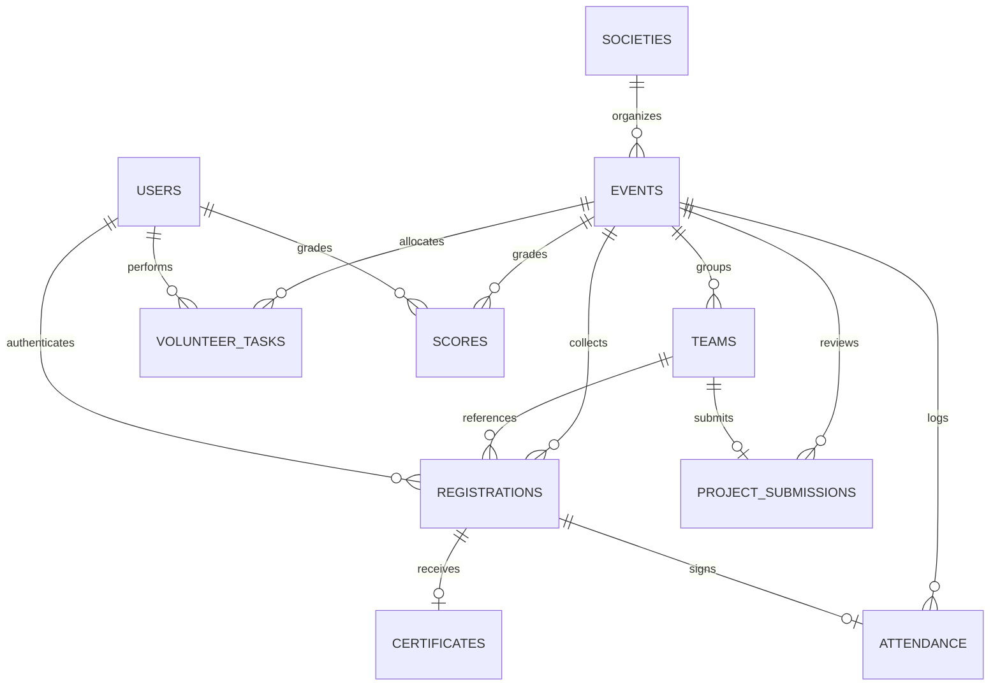

# Logical Database Design Document (LDD)
## Eventspace: Society & Event Management Platform

This document outlines the logical database schema and storage strategy for Eventspace. It details the collections structure, data relationship patterns, indexing logic, dynamic model configurations, and validation constraints.

---

### 1. Database Philosophy

Eventspace utilizes **MongoDB** as its primary persistent database engine. The decision to select a document-oriented database over a relational database is driven by the dynamic and polymorphic requirements of the platform:

* **Flexible Schema:** Events in Eventspace are highly diverse (e.g., Hackathons need team sizes and GitHub repos, workshops need material links, celebrations need volunteer lists). MongoDB's schemaless design allows event documents to store varying configurations without forcing complex column migrations.
* **Dynamic Event Modules:** When an admin activates or deactivates a module (e.g. Judicial Scoring), the system toggles operational flags in the event document. MongoDB permits document mutations (adding/removing fields dynamically) with zero down-time.
* **Custom Registration Forms:** The platform allows event-specific registration forms. Storing these dynamic schemas and the resulting polymorphic participant payloads is highly natural in JSON-like MongoDB documents compared to SQL EAV (Entity-Attribute-Value) patterns.
* **Horizontal Scalability:** Student event registries experience massive concurrent request spikes (e.g., when registration opens). MongoDB Atlas’s serverless replica sets provide auto-scaling to handle high read/write concurrency.

#### 1.1 Honest Trade-offs & Mitigations
* *Lack of Join Operations:* Resolving complex relationships (like referencing users, events, and teams) requires programmatically loading referenced IDs or using `$lookup` aggregations. This is mitigated by selectively denormalizing read-heavy fields (like names) and optimizing indexes.
* *No Schema Enforcements at DB Level:* MongoDB does not enforce strict data types by default. This is mitigated by implementing strict validation contracts at the application layer using an asynchronous ODM (Object-Document Mapper) and data-parsing models.

---

### 2. Collections Overview

Eventspace is composed of the following logical collections:

---

#### 2.1 Users Collection
* **Purpose:** Stores user profiles, security credentials, session metadata, and system roles.
* **Relationships:** Refers to the *Societies* collection (for admins and volunteers).
* **Main Fields:** `name`, `email`, `password_hash`, `role` (enum), `society_id` (nullable), `is_email_verified`, `is_active`, `reset_token`, `last_login`.
* **Growth Expectation:** Linear growth based on student enrollment.

#### 2.2 Societies Collection
* **Purpose:** Stores metadata for college societies.
* **Relationships:** None (acts as a primary tenant node).
* **Main Fields:** `name`, `short_name`, `description`, `logo_url`, `theme_color`, `created_by_user_id`.
* **Growth Expectation:** Low growth (rarely changes after initial setup).

#### 2.3 Events Collection
* **Purpose:** Stores primary event details, schedule timelines, active module arrays, and template types.
* **Relationships:** Refers to *Societies* (many-to-one).
* **Main Fields:** `society_id`, `name`, `description`, `date`, `venue`, `banner_url`, `status` (enum), `active_modules` (array of strings), `registration_deadline`.
* **Growth Expectation:** Linear growth (e.g. 50–100 events per academic year).

#### 2.4 Registrations Collection
* **Purpose:** Records participant registrations, custom form submissions, and ticket statuses.
* **Relationships:** Refers to *Events* (many-to-one), *Users* (nullable, many-to-one), and *Teams* (nullable, many-to-one).
* **Main Fields:** `event_id`, `user_id`, `name`, `email`, `phone`, `custom_fields_data` (polymorphic object), `qr_code_hash`, `check_in_status` (enum).
* **Growth Expectation:** High growth (exponential to the number of events; e.g. 10,000+ registrations annually).

#### 2.5 Teams Collection
* **Purpose:** Groups participants for team-based events.
* **Relationships:** Refers to *Events* (many-to-one) and *Registrations* (one-to-many array).
* **Main Fields:** `event_id`, `team_name`, `leader_registration_id`, `member_registration_ids` (array), `invite_token`, `project_submission_id` (nullable).
* **Growth Expectation:** Linear growth relative to team events.

#### 2.6 ProjectSubmissions Collection (New Module)
* **Purpose:** Stores project submissions for technical team events.
* **Relationships:** Refers to *Events* (many-to-one) and *Teams* (one-to-one).
* **Main Fields:** `event_id`, `team_id`, `github_url`, `live_demo_url`, `demo_video_url`, `document_urls` (array), `notes`, `submitted_at`.
* **Growth Expectation:** Moderate growth (only enabled for technical competitions).

#### 2.7 Attendance Collection
* **Purpose:** Log histories of ticket scans.
* **Relationships:** Refers to *Events* (many-to-one) and *Registrations* (many-to-one).
* **Main Fields:** `event_id`, `registration_id`, `scanned_by_user_id`, `scanned_at`, `scan_status` (enum).
* **Growth Expectation:** High growth, matching registration check-ins.

#### 2.8 VolunteerTasks Collection
* **Purpose:** Tracks tasks assigned to operational student volunteers.
* **Relationships:** Refers to *Events* (many-to-one) and *Users* (volunteer ID, many-to-one).
* **Main Fields:** `event_id`, `volunteer_user_id`, `title`, `description`, `status` (enum), `priority` (enum), `assigned_by_user_id`, `completed_at`.
* **Growth Expectation:** High growth, scales with active fests.

#### 2.9 Scores Collection
* **Purpose:** Stores evaluation grades submitted by judges.
* **Relationships:** Refers to *Events* (many-to-one), *Teams* (many-to-one), and *Users* (judge ID, many-to-one).
* **Main Fields:** `event_id`, `team_id`, `judge_user_id`, `criteria_scores` (key-value subdocument), `total_score`, `comments`.
* **Growth Expectation:** Moderate growth, matching team evaluations.

#### 2.10 Certificates Collection
* **Purpose:** Tracks credentials awarded to participants.
* **Relationships:** Refers to *Events* (many-to-one) and *Registrations* (many-to-one).
* **Main Fields:** `event_id`, `registration_id`, `recipient_name`, `certificate_hash` (unique lookup), `file_url`, `email_sent_status`, `issued_at`.
* **Growth Expectation:** High growth, scales with event completions.

#### 2.11 Notifications Collection
* **Purpose:** Tracks system-wide and targeted alert dispatches.
* **Relationships:** Refers to *Users* (recipient ID, many-to-one).
* **Main Fields:** `recipient_user_id`, `title`, `message`, `type` (enum), `is_read`, `created_at`.
* **Growth Expectation:** Exponential growth (requires a cleanup/archiving strategy).

#### 2.12 Gallery Collection
* **Purpose:** Stores event media assets.
* **Relationships:** Refers to *Events* (many-to-one).
* **Main Fields:** `event_id`, `media_url`, `media_type` (enum), `uploaded_by_user_id`, `created_at`.
* **Growth Expectation:** High growth, matching fest activities.

#### 2.13 Budget Collection
* **Purpose:** Manages financial limits, revenues, and expense transactions for events.
* **Relationships:** Refers to *Events* (many-to-one).
* **Main Fields:** `event_id`, `total_allocation`, `incomes` (array of subdocuments), `expenses` (array of subdocuments), `last_updated_by_user_id`.
* **Growth Expectation:** Low growth, capped per event.

#### 2.14 Feedback Collection
* **Purpose:** Stores post-event survey evaluations.
* **Relationships:** Refers to *Events* (many-to-one) and *Registrations* (optional/nullable to support anonymity).
* **Main Fields:** `event_id`, `registration_id` (nullable), `ratings` (key-value object), `suggestions`, `is_anonymous`.
* **Growth Expectation:** High growth, scales with participant check-outs.

#### 2.15 AuditLogs Collection
* **Purpose:** Records administrative activities for security and compliance audits.
* **Relationships:** Refers to *Users* (actor ID, many-to-one).
* **Main Fields:** `actor_user_id`, `action` (string), `target_model`, `target_id`, `changes_payload` (object), `ip_address`, `timestamp`.
* **Growth Expectation:** Exponential growth. Write-heavy.

---

### 3. Relationships & ER Diagram

The logical relationship structure transitions from high-level college assets down to target event credentials:



---

### 4. Embedding vs Referencing Decisions

MongoDB allows data to be embedded within a parent document or referenced via ID links. The platform applies the following design decisions:

* **Gallery Assets (Referenced):**
  * *Decision:* Referenced (Separate Collection).
  * *Reason:* A single event can accumulate hundreds of gallery images. Embedding them in the *Events* document would risk exceeding the 16MB document size limit and cause performance degradation during event listing queries.
* **Volunteers & Tasks (Referenced):**
  * *Decision:* Referenced (Separate Collection).
  * *Reason:* Volunteers are primary entities (Users) who exist independently of individual events. Storing tasks separately avoids massive document inflation in both the *Users* and *Events* collections.
* **Teams & Members (Referenced):**
  * *Decision:* Referenced (array of Registration IDs).
  * *Reason:* Group structures reference existing registration records. Embedding full registration details would lead to data duplication and synchronization issues if user info is modified.
* **Audit Logs (Referenced/Separate):**
  * *Decision:* Separate Collection.
  * *Reason:* Logs are write-intensive and read-rare. Isolating them prevents write bottlenecks and keeps primary operational tables compact.
* **Budget Ledgers (Embedded Subdocuments):**
  * *Decision:* Embedded (expenses and incomes stored directly in the *Budget* document).
  * *Reason:* An event rarely exceeds 20–30 financial transactions. Keeping them inside the parent *Budget* document enables atomic updates and eliminates costly lookup joins during balance calculations.

---

### 5. Dynamic Registration Form Model

To allow every event to collect unique data without database schema updates, Eventspace utilizes the **Schema Definition Pattern**.

#### 5.1 The Form Schema definition (Stored in Event Document)
The *Events* document contains a `registration_form_schema` array describing the fields to collect:

```json
"registration_form_schema": [
  {
    "name": "resume_file",
    "label": "Upload Resume",
    "type": "resume_upload",
    "required": true
  },
  {
    "name": "programming_experience",
    "label": "Years of Programming",
    "type": "number",
    "required": false
  }
]
```

#### 5.2 Supported Field Types
The form builder supports: `text`, `email`, `phone`, `number`, `dropdown`, `checkbox`, `radio`, `file_upload`, `resume_upload`, `github_url`, `portfolio_url`, `live_demo_url`, `demo_video_url`, `linkedin_url`, and `custom_fields`.

#### 5.3 Storing Submissions (Stored in Registrations Document)
When a user registers, their submission is saved in a polymorphic `custom_fields_data` object matching the schema:

```json
"custom_fields_data": {
  "resume_file": "https://cloudinary.com/resumes/uuid-filename.pdf",
  "programming_experience": 3
}
```
New field types can be supported in the future simply by updating the frontend renderer and backend validators, with zero modifications required on existing database structures.

---

### 6. Indexing Strategy

To maintain low-latency query performance, the following indexes are established:

* **Users.email (1) [Unique]:**
  * *Reason:* Speeds up login authentication lookup and prevents duplicate accounts.
* **Registrations.event_id (1) + Registrations.email (1) [Unique Compound]:**
  * *Reason:* Prevents a participant from registering multiple times for the same event, and accelerates registry exports.
* **Registrations.qr_code_hash (1) [Hash/Unique]:**
  * *Reason:* Accelerates camera scan lookups during venue check-ins.
* **Certificates.certificate_hash (1) [Unique]:**
  * *Reason:* Drives the public credential verification lookup engine.
* **AuditLogs.timestamp (-1):**
  * *Reason:* Speeds up administrative timeline queries which sort logs in descending order.

---

### 7. File Storage Strategy

Eventspace does not store raw binaries, images, or PDFs in MongoDB. 
* All file payloads (banners, photo galleries, expense receipts, resumes, and PDF certificates) are uploaded directly to **Cloudinary**.
* MongoDB only stores the secure HTTPS string URL (e.g. `https://res.cloudinary.com/...`) and the asset's `public_id` (used for deleting or replacing the asset later).
* **Benefit:** Keeps MongoDB storage lightweight, fast, and cost-effective.

---

### 8. Data Validation Strategy

Data integrity is protected by validation layers before persisting records:

* **Required Fields:** Enforced at the application schema validator layer.
* **Unique Constraints:** Managed at the MongoDB level using unique indexes (`email`, `qr_code_hash`, `certificate_hash`) to prevent duplicate writes under concurrent conditions.
* **Enum Constrains:** Restricts inputs to valid options (e.g., event status must be `Draft`, `Published`, `Registration Open`, etc.).
* **Reference Validations:** The service layer verifies that referenced IDs (e.g. `event_id`, `user_id`) exist in their parent collections before writing dependent records.

---

### 9. Soft Delete Strategy

To preserve audit trails and historical reports, Eventspace avoids executing physical delete operations (`DELETE`) on core entities:

* **Implementation:** Models include an `is_archived` (Boolean) field, defaulting to `false`.
* **Flow:** Deleting an event or society sets `is_archived = true`. All listing queries filter out archived entries (`is_archived: false`).
* **Benefit:** Allows administrators to restore accidentally deleted records, preserves financial logs, and retains historic participant statistics.

---

### 10. Audit Strategy

The `AuditLogs` collection tracks administrative actions to guarantee transparency and security. The following triggers create log entries:

* **Event Operations:** Event creation, metadata updates, status changes, and module configuration toggles.
* **Financial Ledger Changes:** Additions or removals of expenses or income records, and updates to the allocated budget limit.
* **Personnel Assignments:** Assigning volunteers to tasks or assigning judges to evaluation lists.
* **Credentials:** Bulk or single certificate generations.
* **Role Modifications:** Promotion or deactivation of user accounts.

---

### 11. Future Expansion Capabilities

The database design accommodates future extensions with minimal alterations:

* **Multi-College Support:** Add a `college_id` reference to *Users*, *Societies*, and *Events*. Query filters can then scope all searches to the user's specific college ID.
* **Payment Integration:** Extend the *Registrations* document with a `payment_details` subdocument storing payment reference IDs, statuses, and gateways.
* **Mobile App Support:** Storing push token strings in the *Users* document enables mobile push notifications.
* **AI & Event Recommendations:** Storing participant interest categories (tags) in *Users* allows execution of recommendation queries using MongoDB aggregation frameworks.
