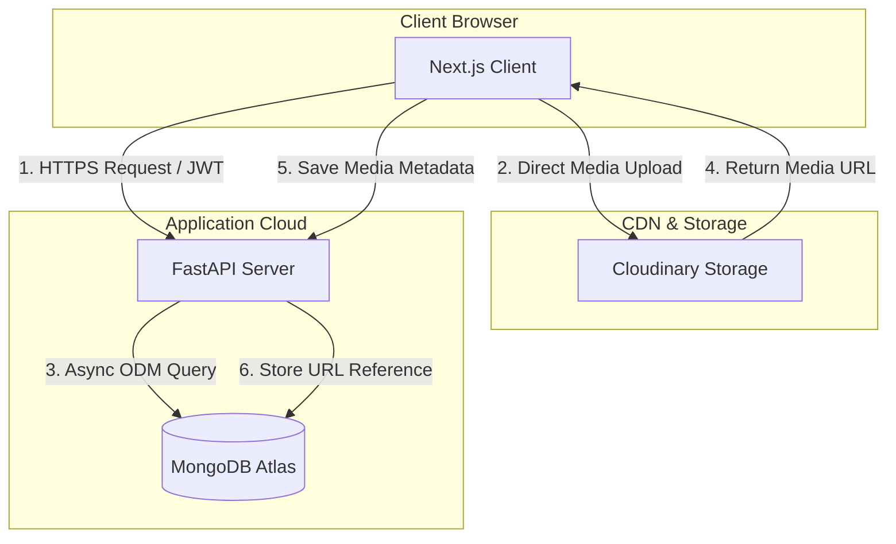
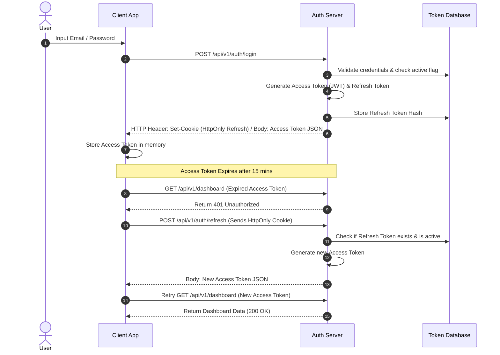
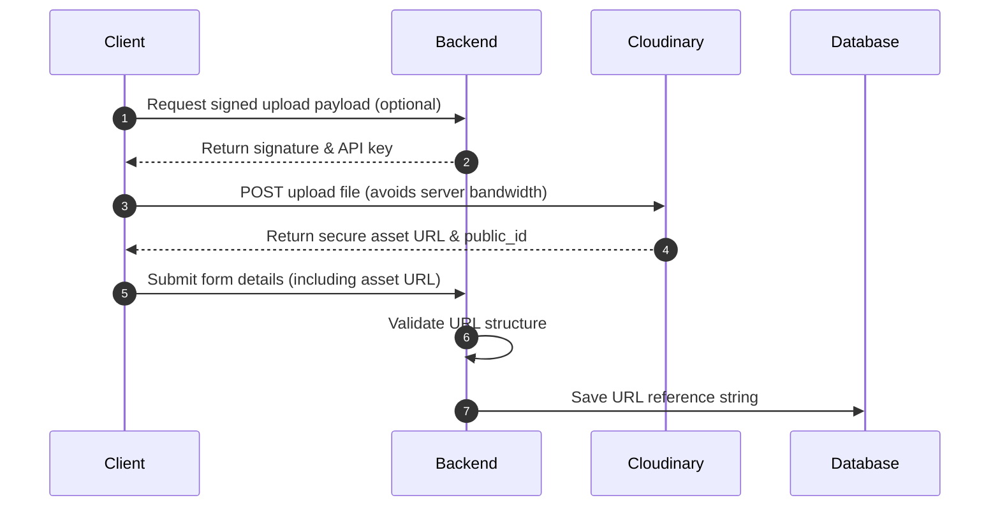
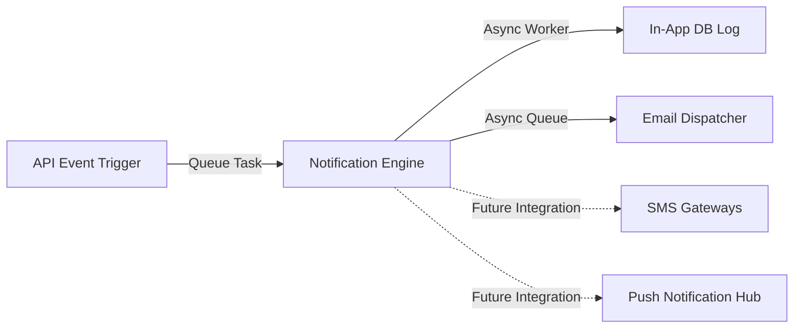
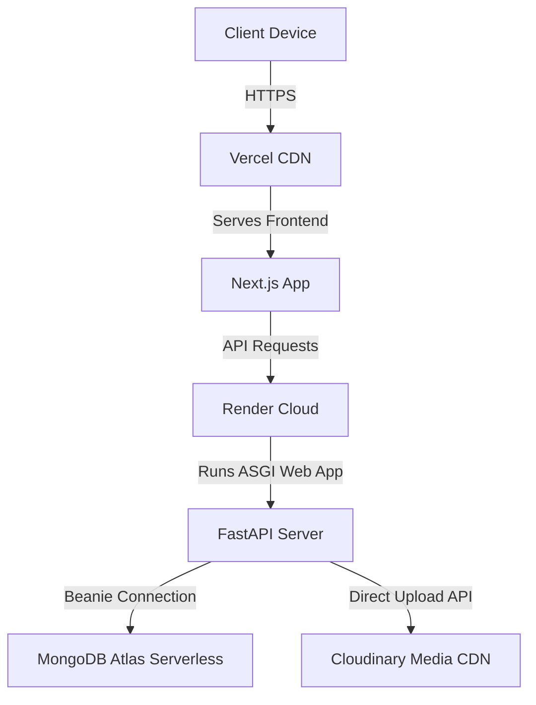

# System Architecture Document (SAD)
## Eventspace: Society & Event Management Platform

This document describes the technical architecture of Eventspace. It serves as a blueprint for development, defining the structural layers, communication protocols, authentication flows, data management strategies, and deployment patterns.

---

### 1. Architecture Goals

The technical architecture of Eventspace is designed around four core pillars:

* **Scalability:** The system must handle high concurrent read/write spikes during university fests and registration windows. The architecture separates computation (Next.js/Vite, FastAPI) from data (MongoDB, Cloudinary) to scale individual components horizontally.
* **Modularity (Extensibility):** The system must adapt to different event configurations dynamically. The core routing and model engine are designed so that new modules can be plugged in or toggled per event without rewriting database schemas or core backend logic.
* **Security & Isolation:** Enforcing strict multi-tenant boundaries (society-level data isolation) is critical. The backend must enforce authentication, authorization, and data boundary validations at every interface layer.
* **Maintainability:** Using a structured, layered design with clean boundaries ensures the code remains understandable, testable, and refactorable by successive student development teams.

---

### 2. Technology Stack Selection

| Layer | Selected Technology | Technical Justification |
| :--- | :--- | :--- |
| **Frontend Framework** | **Next.js** | Provides Server-Side Rendering (SSR) for fast public landing page loads, static optimization for public directories, and client-side routing for the administrative dashboards. |
| **Frontend Type Safety** | **TypeScript** | Eliminates compile-time bugs, enforces consistent payload types corresponding to backend schemas, and improves code readability. |
| **Styling Engine** | **Tailwind CSS** | Promotes highly responsive layouts through utility classes, resulting in small CSS bundles and fast mobile render performance. |
| **UI Components** | **Shadcn UI** | High-quality, accessible (ARIA-compliant) component templates that can be customized to match individual society color themes. |
| **State Management** | **Zustand** | Light, hook-based state manager that avoids the boilerplate of Redux while providing reactive auth session and navigation states. |
| **API Client** | **Axios** | Features request/response interceptors to easily attach JWT bearer tokens and capture global `401 Unauthorized` states. |
| **Backend Framework** | **FastAPI (Python)** | High-performance, asynchronous web framework built on ASGI. Utilizes Pydantic for automated request parsing and OpenAPI generation. |
| **ODM (Database Layer)** | **Beanie ODM** | An asynchronous Object-Document Mapper for MongoDB that integrates natively with Pydantic, enabling unified validation schemas between FastAPI and MongoDB. |
| **Database** | **MongoDB Atlas** | Document-oriented database matching the highly polymorphic nature of configurable event configurations. Serverless hosting aligns with university budgets. |
| **File Storage** | **Cloudinary** | Automates media scaling, transformations (for profile avatars, banners, and receipt uploads), and CDN delivery. |
| **Hosting (Frontend)** | **Vercel** | Out-of-the-box CDN routing, serverless function compilation, and rapid deployment checks. |
| **Hosting (Backend)** | **Render** | Simple ASGI/Docker hosting with support for persistent background workers. |

---

### 3. High-Level Architecture

The platform follows a decoupled Client-Server architecture. The Next.js frontend runs on the client browser and communicates with the FastAPI backend via secure HTTPS endpoints. Media assets are routed directly from the client to Cloudinary, and returned secure URLs are persisted in the database.



---

### 4. Layered Architecture

The system utilizes a structured **Layered (N-Tier) Architecture** to enforce separation of concerns:

```
+-----------------------------------------------------------+
|                      Presentation Layer                   |
|              (Next.js Components & Zustand State)         |
+-----------------------------+-----------------------------+
                              | HTTPS
                              v
+-----------------------------------------------------------+
|                          API Layer                        |
|                  (FastAPI Router Endpoints)               |
+-----------------------------+-----------------------------+
                              | Pydantic Request Models
                              v
+-----------------------------------------------------------+
|                        Service Layer                      |
|                  (Core Business Logic Tasks)              |
+-----------------------------+-----------------------------+
                              | Beanie Model Aggregators
                              v
+-----------------------------------------------------------+
|                    Data Access (Repository)               |
|                    (Beanie ODM / MongoDB Driver)          |
+-----------------------------+-----------------------------+
                              | BSON / Wire Protocol
                              v
+-----------------------------------------------------------+
|                       Database Layer                      |
|                      (MongoDB Atlas)                      |
+-----------------------------------------------------------+
```

#### 4.1 Presentation Layer (Frontend)
* **Responsibility:** Renders the user interface, handles browser routing, maintains UI state, and dispatches HTTP calls.
* **Key Components:** Next.js pages/components, Zustand global stores, and Axios HTTP clients.

#### 4.2 API Layer (Routers)
* **Responsibility:** Declares routes, parses request parameters, enforces rate limits, validates payload syntax (via Pydantic), and manages HTTP response codes.
* **Key Components:** FastAPI APIRouter, FastAPI Dependencies (for auth/permission parsing), and Pydantic schemas.

#### 4.3 Service Layer (Business Logic)
* **Responsibility:** Implements core operational logic, coordinates workflows across multiple models, handles calculations (e.g. scores, budget totals), and triggers external tasks (e.g. email generation).
* **Key Components:** Isolated service classes or functions (e.g., `EventService`, `RegistrationService`).

#### 4.4 Data Access Layer (Repository)
* **Responsibility:** Interfaces with the persistent database, executes queries, manages indexes, and maps raw database documents to backend models.
* **Key Components:** Beanie ODM model instances and MongoDB collection queries.

---

### 5. Request Lifecycle

The sequence diagram below demonstrates the chronological lifecycle of a typical data write request (e.g., registering for a paid workshop):

```mermaid
sequenceDiagram
    autonumber
    actor Participant
    participant FE as Next.js Client
    participant API as FastAPI Router
    participant Auth as Auth Middleware
    participant SVC as Registration Service
    participant DB as MongoDB (Beanie)

    Participant->>FE: Click "Confirm Registration"
    FE->>API: POST /api/v1/events/{id}/register (with JWT)
    API->>Auth: Verify JWT & Tenant Affiliation
    alt Invalid Token / Tenant Violation
        Auth-->>API: Throw 401/403 Exception
        API-->>FE: Return Error JSON
        FE-->>Participant: Show "Unauthorized Alert"
    else Token Valid
        Auth->>API: Inject Current User Context
    end
    API->>SVC: executeRegistration(userData, eventId)
    SVC->>DB: Check Capacity & Deadlines
    DB-->>SVC: Return Event Metrics
    SVC->>DB: createParticipantDocument()
    DB-->>SVC: Persist & Return Participant ID
    SVC-->>API: Return Confirmed Registration Details
    API-->>FE: JSON Response (201 Created)
    FE-->>Participant: Render "Success Check-in screen & QR ticket"
```

---

### 6. Authentication Flow

Authentication is managed via stateless JWT tokens combined with database-backed refresh tokens to balance security and usability.

* **Access Token:** Short-lived (e.g., 15 minutes) bearer token containing user identity and roles. Checked by API middleware.
* **Refresh Token:** Long-lived (e.g., 7 days) token stored in a secure, `HttpOnly`, `SameSite` cookie. Used to obtain new access tokens.
* **Revocation:** Refresh tokens are tracked in a database collection, enabling administrators to force-logout users if necessary.



---

### 7. Role-Based Access Control (RBAC)

RBAC is enforced dynamically at both the routing layer and the controller layer. The permissions are validated using a centralized permission dependency in FastAPI:

```python
# Conceptual Authorization Guard
async def get_current_user_with_permission(
    permission: str,
    current_user: User = Depends(get_current_active_user)
):
    if not has_permission(current_user.role, permission):
        raise HTTPException(status_code=403, detail="Operation forbidden")
    return current_user
```

* **Super Admin:** Global scope. Can write/read all society collections and override global configurations.
* **Society Admin:** Tenant scope. Restricted to their own society data (`society_id` boundary check is executed on all queries).
* **Core Team:** Operational scope. Can modify schedules and view budgets for their specific society, but cannot delete events.
* **Volunteer:** Operations scope. Can read task lists, update assigned tasks, and call attendance-scanning endpoints.
* **Judge:** Evaluation scope. Access restricted to assigned teams and scoring inputs.
* **Participant:** User scope. Access restricted to their own registrations and credentials.
* **Guest:** Public scope. Read-only access to published event details.

---

### 8. Module Engine

The dynamic composition of event instances is achieved through a **Polymorphic Event Configuration pattern** in the database. 

Instead of hardcoding relationships, the `Event` document contains an array of active module identifiers. The service layer inspects these flags before allowing actions:

```json
// Example MongoDB Event Document Schema
{
  "_id": "6a4a16b72bb902c806c1da66",
  "name": "CodeStorm Hackathon 2026",
  "society": "5f9b3f3b9c9d4b001f3c3d1a",
  "date": "2026-07-15T09:00:00Z",
  "active_modules": [
    "registration",
    "team_management",
    "project_submission",
    "attendance_scan",
    "judicial_scoring",
    "credential_generation"
  ]
}
```

#### 8.1 Core Controller Guard Pattern
Whenever a client invokes an API corresponding to a toggleable module (e.g., uploading a project submission), the backend executes a validation guard:

```python
# Module Active Guard Logic
async def verify_module_active(event_id: ObjectId, module_name: str):
    event = await Event.get(event_id)
    if not event or module_name not in event.active_modules:
        raise HTTPException(
            status_code=400, 
            detail=f"The module '{module_name}' is not enabled for this event."
        )
```

#### 8.2 Future Module Scalability
To add a new module (e.g., "Live Polls Module") in the future:
1. Define the database schema for the new module referencing the `event_id`.
2. Add the module key (e.g., `"live_polls"`) to the global templates.
3. Write the new service/routers using the `verify_module_active` guard.
4. **Result:** No modification is required on existing collections, and legacy events continue running without database migrations.

---

### 9. Media Architecture

All media uploads are handled directly or indirectly using Cloudinary to offload storage costs and server computing overhead.



* **Banners & Galleries:** Stored in categorized Cloudinary folders under the `society-event-platform/` root namespace. Images are processed with a maximum width transformation (e.g., `width=1600, crop=limit`) to preserve CDN bandwidth.
* **Documents & Resumes:** Uploaded as raw assets to secure Cloudinary buckets. The frontend accesses these files via HTTPS links.
* **Certificates:** Generated dynamically on the backend, saved to disk temporarily during generation, uploaded to Cloudinary, and distributed. The database stores the public URL string.

---

### 10. Notification Architecture

To keep the application highly responsive and avoid blocking user requests during network operations, all notification dispatches are handled asynchronously.



* **In-App Notifications:** Logs are written to a `Notification` collection and fetched by client dashboard components via standard polling or real-time queries.
* **Email Notifications:** The backend utilizes an asynchronous worker pool or event loops to send HTML emails, preventing network latency from blocking API responses.
* **Future Channels (Push/SMS/WhatsApp):** Abstracted through a unified notifier interface, allowing these providers to be plugged in as service adapters without altering the main triggering code.

---

### 11. Logging Strategy

System logging is categorized into distinct streams to facilitate debugging and ensure compliance auditing:

* **Application Logs:** Tracks routing requests, server diagnostics, and operational flows. Managed via standard logging frameworks outputting to standard output (`stdout`).
* **Audit Logs:** Immutable database logs capturing administrative updates (*Who*, *What*, *When*, and *Object ID* metadata). Used to resolve security or compliance discrepancies.
* **Error Logs:** Captures unhandled stack traces and database transaction timeouts, routing them to monitoring channels.
* **Security Logs:** Records failed login attempts, unauthorized API calls, and suspicious multi-tenant crossover attempts.

---

### 12. Error Handling Strategy

The application enforces a **Centralized Exception Interception pattern** on both backend and frontend layers:

#### 12.1 Backend Exception Handler
A global exception handler middleware catches all standard platform exceptions and converts them into structured JSON payloads:

```json
{
  "success": false,
  "error": "Error message description detailing what failed",
  "code": "SPECIFIC_ERROR_CODE",
  "timestamp": "2026-07-05T11:02:42Z"
}
```
* *Client Errors (400):* Validation parameters fail.
* *Validation Errors (422):* Form inputs fail format schema checks.
* *Authentication Errors (401/403):* JWT expired or tenant privilege violation.
* *Server Errors (500):* Database disconnection or unhandled failures.

#### 12.2 Frontend Interceptor
Axios response interceptors inspect returned error codes. A `401` status triggers automatic token deletion and redirects the user to `/login`, while other error codes display diagnostic toasts to the user.

---

### 13. Security Strategy

* **Password Protection:** Cryptographic hashing is executed on the user model using a secure cryptographic hashing algorithm (e.g. Argon2id or bcrypt) with a high work factor salt before storage.
* **HTTPS-Only:** Transport layer security (TLS) is enforced globally; all non-secure HTTP traffic is redirected to HTTPS.
* **Rate Limiting:** Protects authorization endpoints (`/login`, `/register`) and search tools from brute force attacks using sliding-window rate limit counters.
* **Data Sanitization:** Strict input validations via Pydantic model schemas filter out illegal characters, protecting the system from Mongo injection and cross-site scripting (XSS) vectors.
* **File Upload Filters:** File uploads restrict file size (e.g., maximum 5MB) and validate MIME types (e.g., allowing only `application/pdf`, `image/png`, `image/jpeg`).

---

### 14. Scalability Strategy

The architecture supports horizontal scaling and feature extension without database redesign:

* **Stateless API Services:** Since the FastAPI backend relies on JWT tokens and holds no user session states in memory, instances can be duplicated behind load balancers during peak traffic periods.
* **Decoupled Asynchronous Workload:** Long-running tasks (e.g., compiling PDF certificates, sending batch emails) are executed asynchronously outside the HTTP request loop.
* **Database Scaling:** MongoDB Atlas supports seamless horizontal sharding and replica set clustering to distribute search index queries.

---

### 15. Deployment Architecture

Eventspace is deployed across modular, optimized cloud environments to ensure low costs, rapid deployments, and zero hardware maintenance overhead:



* **Frontend:** Hosted on Vercel, leveraging Edge CDN caching for fast loading of event landing pages.
* **Backend:** Deployed on Render as a managed ASGI service, auto-deploying from the GitHub repository.
* **Database:** Hosted on MongoDB Atlas Serverless, scaling storage dynamically based on active usage.
* **Media Assets:** Served globally through Cloudinary CDN.

---

### 16. Architecture Decision Summary

| Decision | Reason | Benefits | Trade-offs |
| :--- | :--- | :--- | :--- |
| **Layered Architecture** | Clean separation of routing, logic, and data access. | Highly testable; modular components can be updated independently. | Slightly higher code duplication during setup compared to direct scripting. |
| **Next.js & FastAPI Separation** | Decouples front-end UI delivery from CPU-intensive computational processes. | Allows scaling the FastAPI backend separately; provides robust OpenAPI generation. | Requires configuring Cross-Origin Resource Sharing (CORS) security headers. |
| **MongoDB Document Model** | Supports highly polymorphic configurations for events and registration forms. | Schema alterations do not require execution of complex table migrations. | Relational integrity checks must be managed programmatically in the Service Layer. |
| **Direct-to-Cloud Media Upload** | Offloads file upload bandwidth and streaming overhead from the backend server. | Keeps the Render backend instance light and highly responsive. | Requires client-side upload keys orchestration. |
| **Beanie ODM over Raw Motor** | Integrates natively with Pydantic for validation. | Eliminates manual dictionary mapping and enforces type safety. | Introduces a library dependency layer on top of the native MongoDB driver. |
| **Stateless JWT Auth** | Eliminates server-side session lookup queries during requests. | Maximizes backend scale potential. | Invalidating tokens before expiration requires tracking a blacklist. |
